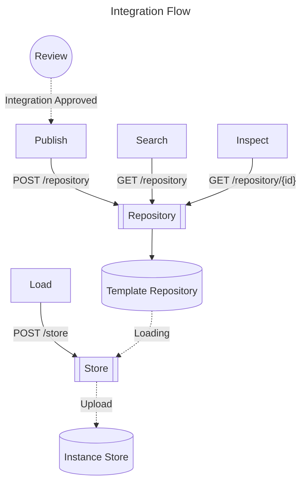
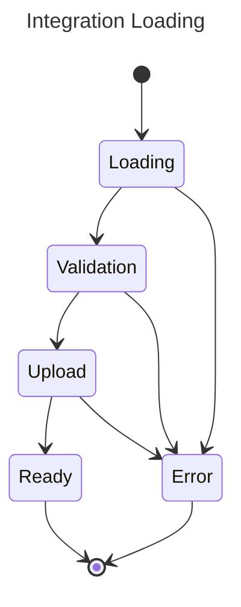

# Integration Plugin Tasks

**Date:** 9 May, 2023

This document describes the responsibilities of the Integrations Plugin.
The Integrations Plugin is responsible for two tasks:

1. Catalog Registration:
   The catalog contains components that integrations use to represent data types.
   It is shipped with the plugin as a resource,
   and is lazy loaded on request.
2. Integration Loading:
   Processing an integration template for usage by the user as an instance.
   This includes a few steps:
   - Retrieve the integration's data.
   - Validate the integration for correctness.
   - Validate the state of relevant dependencies.
   - Return status results to the user.

These two tasks are split across three endpoints.

1. `/catalog`: available catalogs that integrations can reference.
2. `/repository`: available integration templates that can be loaded into ready instances.
3. `/store`: concrete integration instances, connected to instantiated data.

Important endpoints are summarized here.
For a field-by-field breakdown of each endpoint, see the [API Documentation](API/README.md).

## Catalog Registration

As needed, the Integrations Plugin will lazily load [Catalogs](schema/README.md).
Catalogs contain entity types that are referenced by Integrations, called components.
Components describe the expected format of the data in any provided indices.
Integration validation involves asserting that all provided assets use this format.

As an example, consider the [Observability Catalog](schema/observability).
It contains three types that are ubiquitous throughout the observability domain:

- [Logs](../src/main/resources/schema/observability/logs/logs.mapping)
- [Metrics](../src/main/resources/schema/observability/metrics/metrics.mapping)
- [Traces](../src/main/resources/schema/observability/traces/traces.mapping)

In addition to a data format schema, they each contain an index pattern.
The index pattern specifies where the data is expected to be stored.
These patterns conform to the existing [Naming Convention](observability/Naming-convention.md).

### API

A Catalog contains the following queryable fields:

- Catalog: The name of the catalog.
- Version: The version of the catalog, following Semantic Versioning.
- Category: A collection of components,
            generally containing a main component with optional subcomponents.
- Tags: Any further semantic tags associated with components.

Some example search queries are provided here:

#### Querying Catalogs

<details>
    <summary>
        <code>GET</code>
        <code><b>/_integration/catalog</b></code>
        <span>Lists catalog elements based on query.</span>
    </summary>

##### Parameters

| Name       | Type     | Data type               | Description                                                                   |
|------------|----------|-------------------------|-------------------------------------------------------------------------------|
| catalog    | required | String                  | The name of the catalog to search                                             |
| version    | optional | SemVer String           | The version of the catalog to load (default: latest)                          |
| categories | optional | Comma-separated strings | All results must be a part of at least one of these categories (default: any) |
| tags       | optional | Comma-separated strings | All results must have all of these tags (default: none)                       |

##### Responses

| Http Code | Content-Type       | Response                                           |
|-----------|--------------------|----------------------------------------------------|
| `200`     | `application/json` | `{"totalHits": 2, "hits": [/* Document Array */]}` |
| `400`     | `application/json` | `{"code": 400, "message": "/* Error Message */"}`  |

##### Example cURL

```sh
$ curl "http://localhost:9200/_plugin/_integration/catalog?catalog=observability&categories=logs&tags=web"
```
</details>

---

## Integration Repository

The Repository contains integration templates.
These are integrations that are not yet connected to any data.
They include display assets and data formats,
but need to be loaded before they can be used.

Templates can be uploaded to the repository by users.
The plugin comes with pre-bundled templates that are lazy-loaded on request.
Each template is defined by a [Config file](schema/system/samples/integration.json).

### External Integrations

*External Integrations* are integrations not included in the default integrations bundle.
They are published by the user.
External Integrations are packaged as a `zip` file that contains:

- `/config.json`: A config file describing the integration's dependencies.
- `/schema`: A copy of the data format that the integration depends on to function.
- `/assets`: External resources that are tied to the integration, including:
  - `/assets/display`: Display elements to be loaded in OpenSearch Dashboards.
  - `/assets/meta`: Metadata for presenting the integration to other users, such as a logo.

This zipped bundle is uploaded to the `/repository` API.

In addition to the repository index, the Integration may use a repository cache that will allow the F/E to retrieve additional content residing in the integration folder directly (images, html pages, URLs).

#### Flow Diagram



#### Querying the Repository

<details>
    <summary>
        <code>POST</code>
        <code><b>/_integration/repository</b></code>
        <span>Publish an integration template to the repository.</span>
    </summary>

##### Parameters

| Name | Type     | Data type         | Description                   |
|------|----------|-------------------|-------------------------------|
| Body | required | `application/zip` | The zipped integration bundle |

##### Responses

| Http Code | Content-Type       | Response                                          |
|-----------|--------------------|---------------------------------------------------|
| `200`     | `application/json` | `{"objectId": "sampleId", /* More fields */}`     |
| `400`     | `application/json` | `{"code": 400, "message": "/* Error Message */"}` |

##### Example cURL

```sh
$ curl -X POST -H "Content-Type: application/zip" -d @integrationBundle.zip \
  "http://localhost:9200/_plugin/_integration/repository"
```
</details>

<details>
    <summary>
        <code>GET</code>
        <code><b>/_integration/repository</b></code>
        <span>Lists integration templates based on query.</span>
    </summary>

##### Parameters

| Name       | Type     | Data type               | Description                                                                   |
|------------|----------|-------------------------|-------------------------------------------------------------------------------|
| catalog    | optional | String                  | A catalog that the integration is a part of                                   |
| version    | optional | SemVer String           | The version of the template to load (default: latest)                         |
| categories | optional | Comma-separated strings | All results must be a part of at least one of these categories (default: any) |
| tags       | optional | Comma-separated strings | All results must have all of these tags (default: none)                       |

##### Responses

| Http Code | Content-Type       | Response                                           |
|-----------|--------------------|----------------------------------------------------|
| `200`     | `application/json` | `{"totalHits": 2, "hits": [/* Document Array */]}` |
| `400`     | `application/json` | `{"code": 400, "message": "/* Error Message */"}`  |

##### Example cURL

```sh
$ curl "http://localhost:9200/_plugin/_integration/repository?categories=logs,traces&tags=web"
```
</details>

<details>
    <summary>
        <code>GET</code>
        <code><b>/_integration/repository/{id}</b></code>
        <span>Inspect a single integration template by ID.</span>
    </summary>

##### Parameters

| Name     | Type     | Data type               | Description                            |
|----------|----------|-------------------------|----------------------------------------|
| id       | required | String                  | The unique identifier for the template |

##### Responses

| Http Code | Content-Type       | Response                                          |
|-----------|--------------------|---------------------------------------------------|
| `200`     | `application/json` | `{"objectId": "sampleId", /* More fields */}`     |
| `400`     | `application/json` | `{"code": 400, "message": "/* Error Message */"}` |
| `404`     | `application/json` | `{"code": 404, "message": "Not found"}`           |

##### Example cURL

```sh
$ curl "http://localhost:9200/_plugin/_integration/repository/sampleId"
```
</details>

## Integration Loading

When the correct Integration template is stored in the repository,
this is the final step for preparing the integration.
Loading consists of the following stages.



The two terminal states are:

- `Ready`: The Integration was successfully loaded, and is ready to be displayed.
- `Error`: A loading step failed, user intervention is needed.
  Maintenance can fail for various reasons:
  - `Loading`: The requested template could not be retrieved from the repository.
  - `Validation`: The template was found, but is not valid.
  - `Upload`: The integration was valid but could not be stored (e.g. due to a name collision).

When an integration is `Ready`, the dependencies are set up,
and it is ready to ingest data.
However, changes are exclusively to the underlying OpenSearch cluster.
To display the integration, the integration's display assets need to be separately imported to OpenSearch Dashboards.
These assets are accessible under `/_integration/store/{id}/assets`.
When using the OpenSearch Dashboards Integrations functionality,
this step will be done automatically.

<details>
    <summary>
        <code>POST</code>
        <code><b>/_integration/store</b></code>
        <span>Load an integration template into the store.</span>
    </summary>

##### Parameters

| Name | Type     | Data type | Description                  |
|------|----------|-----------|------------------------------|
| Body | required | JSON      | `{"template-name": "nginx"}` |

##### Responses

| Http Code | Content-Type       | Response                                                                   |
|-----------|--------------------|----------------------------------------------------------------------------|
| `201`     | `application/json` | [An integration instance](schema/system/samples/integration-instance.json) |
| `400`     | `application/json` | `{"code": 400, "state": "VALIDATION", "message": "/* Error Message */"}`   |

##### Example cURL

```sh
$ curl -X POST -H "Content-Type: application/json" -d @config.json "http://localhost:9200/_plugin/_integration/store"
```
</details>

<details>
    <summary>
        <code>GET</code>
        <code><b>/_integration/store/{id}</b></code>
        <span>Inspect a single integration instance by ID.</span>
    </summary>

##### Parameters

| Name     | Type     | Data type               | Description                            |
|----------|----------|-------------------------|----------------------------------------|
| id       | required | String                  | The unique identifier for the instance |

##### Responses

| Http Code | Content-Type       | Response                                                           |
|-----------|--------------------|--------------------------------------------------------------------|
| `200`     | `application/json` | `{"instance": "nginx-prod", /* More fields */}` |
| `400`     | `application/json` | `{"code": 400, "message": "/* Error Message */"}`                  |
| `404`     | `application/json` | `{"code": 404, "message": "Not found"}`                            |

##### Example cURL

```sh
$ curl "http://localhost:9200/_plugin/_integration/store/sampleId"
```
</details>

<details>
    <summary>
        <code>GET</code>
        <code><b>/_integration/repository/{id}/assets</b></code>
        <span>Retrieve Saved Object Assets associated with the integration.</span>
    </summary>

##### Parameters

| Name     | Type     | Data type               | Description                            |
|----------|----------|-------------------------|----------------------------------------|
| id       | required | String                  | The unique identifier for the instance |

##### Responses

| Http Code | Content-Type           | Response                                                        |
|-----------|------------------------|-----------------------------------------------------------------|
| `200`     | `application/x-ndjson` | A Saved Object document to be imported in OpenSearch Dashboards |
| `400`     | `application/json`     | `{"code": 400, "message": "/* Error Message */"}`               |
| `404`     | `application/json`     | `{"code": 404, "message": "Not found"}`                         |

##### Example cURL

```sh
$ curl "http://localhost:9200/_plugin/_integration/store/sampleId/assets"
```
</details>

<details>
    <summary>
        <code>GET</code>
        <code><b>/_integration/store/{id}/status</b></code>
        <span>Check the status of an integration.</span>
    </summary>

##### Parameters

| Name     | Type     | Data type               | Description                            |
|----------|----------|-------------------------|----------------------------------------|
| id       | required | String                  | The unique identifier for the instance |

##### Responses

| Http Code | Content-Type       | Response                                          |
|-----------|--------------------|---------------------------------------------------|
| `200`     | `application/json` | `{"instance": "nginx-prod", "status": "READY"}`   |
| `400`     | `application/json` | `{"code": 400, "message": "/* Error Message */"}` |
| `404`     | `application/json` | `{"code": 404, "message": "Not found"}`           |

##### Example cURL

```sh
$ curl "http://localhost:9200/_plugin/_integration/store/sampleId/status"
```

</details>
