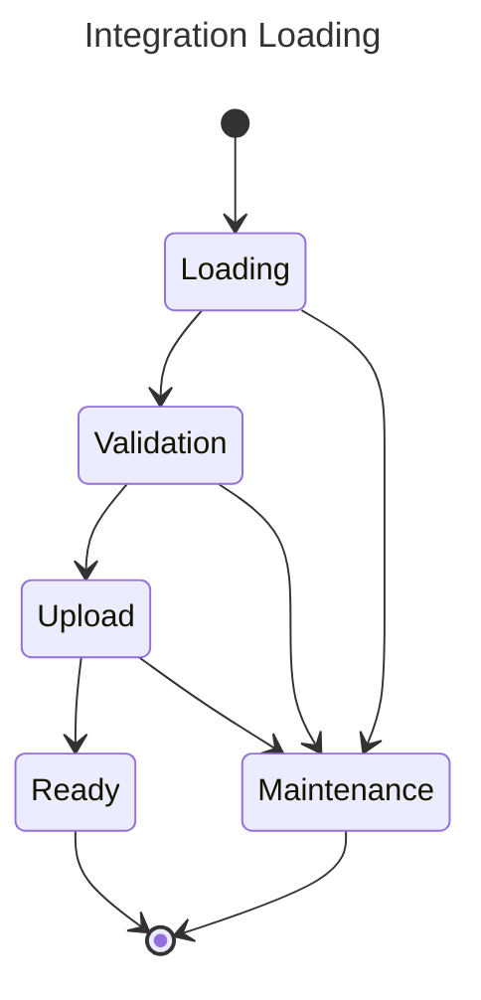

# Integration Plugin Tasks

This document describes the responsibilities of the Integrations Plugin.
The Integrations Plugin is responsible for two tasks:

1. Catalog Registration:
   The catalog contains components that integrations use to represent data types.
   It is shipped with the plugin as a resource,
   and is lazy loaded on request.
2. Integration Loading:
   Processing an uploaded integration for usage by the user.
   This involves:
   storing the integration's data,
   validating the integration for correctness,
   and giving the user access to the results.

## Catalog Registration

As needed, the Integrations Plugin will lazily load [Catalogs](schema/README.md).
Catalogs contain entity types that are referenced by Integrations, called components.
Components describe the expected format of the data in any provided indices.
Integration validation involves asserting that all provided assets use this format.

As an example, consider the [Observability Catalog](schema/observability).
It contains three types that are ubiquitous throughout the observability domain:

- [Logs](../src/main/resources/schema/observability/logs/logs.mapping)
- [Metrics](../src/main/resources/schema/observability/metrics/metrics.mapping)
- [Traces](../src/main/resources/schema/observability/traces/traces.mapping)

In addition to a data format schema, they each contain an index pattern.
The index pattern specifies where the data is expected to be stored.
These patterns conform to the existing [Naming Convention](observability/Naming-convention.md).

### API

A Catalog contains the following queryable fields:

- Catalog: The name of the catalog.
- Version: The version of the catalog, following Semantic Versioning.
- Category: A collection of components,
            generally containing a main component with optional subcomponents.
- Tags: Any further semantic tags associated with components.

Some example search queries are provided here:

#### Querying Catalogs

<details>
    <summary>
        <code>GET</code>
        <code><b>/_integration/catalog</b></code>
        <span>Lists catalog elements based on query</span>
    </summary>

##### Parameters

| Name     | Type     | Data type               | Description                                                |
|----------|----------|-------------------------|------------------------------------------------------------|
| catalog  | required | String                  | The name of the catalog to search                          |
| version  | optional | SemVer String           | The version of the catalog to load (default: latest)       |
| category | optional | String                  | A sub-collection of components to filter by (default: all) |
| tags     | optional | Comma-separated strings | Any result must have all of these tags (default: none)     |

##### Responses

| Http Code | Content-Type       | Response                                 |
|-----------|--------------------|------------------------------------------|
| `200`     | `application/json` | `{"totalHits": 2, "hits": [...]}`        |
| `400`     | `application/json` | `{"code": 400, "message":"Bad Request"}` |

##### Example cURL

```sh
$ curl -X GET "http://localhost:9200/_plugin/_integration/catalog?catalog=observability&category=logs&tags=web"
```
</details>

---

## Integration Registry

During the Integration plugin loading,
it will scan the Integration folder
(or any resource that functions as the integration repository)
and load each repository [config file](../src/main/resources/schema/system/integration.schema)
into an in memory cache / index
allowing to query and filter according to the different integration attributes.

### External Integrations' registry loading
"External integrations" (ones that are not packaged in the original integrations bundle) can be published by the user.
These "external" integrations are packages as a zip bundle and contain all the relevant resources including:

- `images`
- `assets`
- `documents`
- `icons`

Once the user has uploaded this zip bundle using the `POST /repository` API, this bundle will be maintained inside the repository index (Blob file or extracted bundle).

In addition to the repository index, the Integration may use a repository cache that will allow the F/E to retrieve additional content residing in the integration folder directly (images, html pages, URLs).

#### Flow Diagram


Once the Integration has completed loading, it will allow to query the cache content using the following REST api:

Filter integration according to its attributes:

```http
GET _integration/repository?filter=type:Logs&category:web,html
```

Results a list of integrations.

Query integration by name:

```http
GET _integration/repository/$template_name
```

Results in a single integration.


### Integrations Loading

Once the user has selected which integration he want's to load, her will call the next API:
```
PUT _integration/store/$instance_name 
```
The body of the request will be the integration config file. It is also possible that during the user interaction he would like to update the index naming pattern that the integration instance will use. 
It will be reflected in the appropriate section of the integration config json

_For example the next observability integration:_
```json5
{  
  "collection": [
    {
      "logs": [
        {
            "info": "access logs",
            "input_type": "logfile",  
            "dataset": "nginx.access", // Subject to user changes
            "namespace": "prod", // Subject to user changes
            "labels": ["nginx", "access"],
            "schema": "file:///.../schema/logs/access.json"
        }
      ]
    }
  ]
}
```
### Loading Step

The integration progresses through the following state machine while loading:



The two terminal results are:

- `Ready`: The Integration was successfully loaded.
- `Maintenance`: A loading step failed, a user intervention is needed.

After the `_integration/store/$instance_name` API was called the next steps will occur: 

 - The integration object will be inserted into the `.integration` index with a `LOADING` status.
   - During this step, the integration engine will rename all the assets names according to the user's given name `${instance_name}-assetName.json`.
     - This can also be extended using more configurable patterns such as `${instance_name}-{dataset}-{namespace}-assetName.json`.
   - Update the index template's `index_pattern` field with the added pattern.
       - "index_patterns":` ["ss4o_logs-*-*"]` -> `["ss4o_logs-*-*", "myLogs-*"]`.
   - If user selected custom index with proprietary fields, a mapping must be configured. See: [field aliasing](Integration-fields-mapping.md).

---

   - **Success**: If the user changes the data-stream / index naming pattern - this will also be changes in every assets that supports such capability.
   - **Fail**:    If the validation fails the integration status would be updated to `maintenance` and an appropriate response should reflect the issues.
   
 
   - **Response**:
   ```json
   {
     "instance": "nginx-prod",
     "integration-name": "nginx",
     "status": "maintenance",
     "phase": "LOADING",
     "issues": []
   }
   ```

 - Next the integration will undergo a validation phase -  marked with a `VALIDATION` status.
      - Assets will be validated with the schema to match fields to the mapping.
      - Assets containing index patterns will be validated any index with these pattern exists.
      - Datasource will be validated to verify connection is accessible.
      - Mapping templates are verified to exist.

---

   - **Success**: If the validation succeeds the integration status would be updated
   - **Fail**:   If the validation fails the integration status would be updated and the next response would return.

   - **Response**:
     ```json
     {
       "instance": "nginx-prod",
       "integration-name": "nginx",
       "status": "maintenance",
       "phase": "VALIDATION",
       "issues": [
         { 
           "asset": "dashboard",
           "name": "nginx-prod-core",
           "url": "file:///.../nginx/integration/assets/nginx-prod-core.ndjson",
           "issue": [
             "field cloud.version is not present in mapping sso_log-nginx-prod"
           ]
         }
       ]
     }
     ```

- The assets are being uploaded to the objects store index, if the users cherry pick specific assets to upload they will be loaded as requested.

---

- **Success**: If the upload succeeds the integration status would be updated and the user will get the success status response
- **Response:**
```json
 {
    "instance": "nginx-prod",
    "integration-name": "nginx",
    "phase": "UPLOAD",
    "status": "ready"
 }
```
   
- **Fail**: If the bulk upload fails the integration status would be updated and the next response would return.
- **Response**:
```json
{
"instance": "nginx-prod",
"integration-name": "nginx",
"status": "maintenance",
"phase": "VALIDATION",
"issues": [
  { 
    "asset": "dashboard",
    "name": "nginx-prod-core",
    "url": "file:///.../nginx/integration/assets/nginx-prod-core.ndjson",
    "issue": [
      "field cloud.version is not present in mapping sso_log-nginx-prod"
    ]
  }
]
}
```

---

### Additional supported API:

Status API for Integration `_integration/store/$instance_name/status` will result in :
- **Response:**
   ```json
   {
       "instance": "nginx-prod",
       "integration-name": "nginx",
       "phase": "UPLOAD",
       "status": "ready"
   }
   ```


Activate / deactivate integration `_integration/store/$instance_name/activate` / `_integration/store/$instance_name/disable` will result in status :
- **Response:**
   ```json
   {
       "instance": "nginx-prod",
       "integration-name": "nginx",
       "phase": "DISABLE",
       "status": "ready"
   }
   ```
#### Deactivation
   The result of deactivating an integration would cause all the assets to disable.

#### Activation
   The result of activation would depend on the existing status & phase of the Integration
    - if not in is ready status - will try to continue the next phases.
    - if is ready status - will try to update status to disabled
