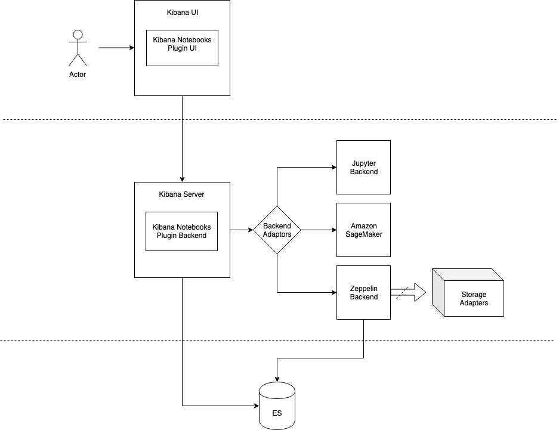
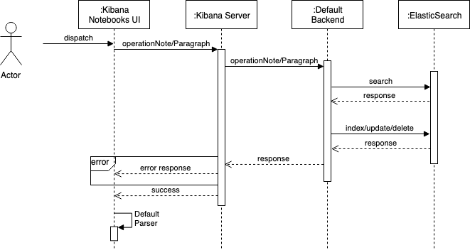

# RFC - Kibana Notebooks

## Contents

1. [Overview](#1-overview)
2. [Requirements](#2-requirements)
3. [User Stories](#3-user-stories)
4. [Design](#4-design)
5. [Design Details and Implementation](#5-design-details-and-implementation)
6. [Build & Usage](#6-build--usage)
7. [Appendix](#7-appendix)
8. [References](#8-references)

## 1. Overview

### **1.1 Introduction**

Kibana Notebooks enable data-driven, interactive data analytics and collaborative documents to be created and used as live notes in Kibana. They allow devops, support specialists, solution and presales specialists, customer success experts and engineers to create and share stories. They facilitate combining visualizations, timelines and text, code and adding annotations. Here are a few Kibana Notebooks use-cases:

1. Create post-mortem documents
2. Design runbooks
3. Build Live infrastructure reports
4. Foster data driven explorative collaborations

### **1.2 Motivation**

- **Existing Solution:** Kibana Dashboards offer a solution for a few selected use cases, and are a great tool if you’re focused on monitoring a known set of metrics over time. Current issues include:
  - Dashboards are static in nature and are not user-friendly to make quick changes in iterations
  - Dashboards lack context for visualizations
  - Dashboards do not have multi-timeline support which are needed for post-mortem and cause analysis
  - Dashboards are restricted to data sources within the Elasticsearch environment

* **Our Solution:** Kibana Notebooks provide:
  - Familiar notebooks user-interface for faster iterations as live notes
  - Markdown/Code interpreters for contextual use of data with detailed explanations by allowing a user to combine saved visualizations, text and graphs
  - Adaptors to embellish existing data in Elasticsearch with other reference data sources.
  - Support multiple timelines to compare and contrast visualizations

### **1.3 Glossary**

1. _Notebooks:_ An interface for on-the-go code writing and execution
2. _Paragraphs:_ Each notebook consists on multiple paragraphs with allows users to input code or embed a visualization
3. _Input Cell:_ Each paragraph consists an input cell that contains code for execution in supported interpreters such as markdown, SQL and DSL.
4. _Output Cell:_ Each paragraph consists an output cell that contains execution result of code or an embeded visualization with its time-range
5. _Backend Adaptor:_ An add-on to the existing default backend that provides additional interpreters and storage options.

## 2. Requirements

**Functional:**

1. **Notebooks**
   1. As a user, I should be able to use Kibana Notebooks plugin UI for all the interactions
   2. As a user, I should be able to View all the notebooks available
   3. As a user, I should be able to Create, Edit, Rename, Delete and Clone Notebooks
   4. As a user, I should be able to Import and Export Notebooks for collaborative story telling
2. **Paragraphs**
   1. As a user, I should be able to use Create, Edit, Save, Delete and Clone Paragraphs
   2. As a user, I should be able to use Toggle all Inputs of paragraphs
   3. As a user, I should be able to use Clear and Toggle all Outputs of paragraphs
3. **Visualizations**
   1. As a user, I should be able to embed Saved Visualizations
   2. As a user, I should be able to Resize and Delete embedded Visualizations
   3. As a user, I should be able to use multiple timelines for different visualizations
   4. As a user, I should be able to Inspect Visualization Data
4. **Default Backend**
   1. As a user, I should be able to use Visualizations and Markdown interpreter in Notebooks
   2. As a user, I should be able to use SQL and DSL query interpreters in Notebooks
   3. As a user, I should be able to store Notebooks as Elasticsearch indices
5. **Backend Adaptors**
   1. As a user, I should be able to plug an add-on external backend services (like [Apache Zeppelin](https://zeppelin.apache.org/), [Amazon SageMaker](https://aws.amazon.com/sagemaker/), [Jupyter](https://jupyter.org/)) to the plugin using adaptors
   2. As a user, I should be able to use all the interpreters provided by the plugged backend service in addition to those provided by default
   3. As a user, I should be able to use the storage adaptors provided by the plugged backend service
   4. As a user, I should be able to use external data sources and environments provided by the plugged backend

**Non-functional:**

1. **Default Backend** - As a user, I should be able to use the plugin’s default interpreters without setting up any external backend service
2. **Backend Adaptors** - As a user, I should be free to create and use external data planes/environments and bring them to Kibana via supported adaptors
3. **Security** - As a user, I should be able to view/clone/read/save/edit notebooks adhering to my role settings

## 3. User Stories

**Operations on notebooks**

1. Create: As a user, I should be able to create a notebook.
2. View: As a user, I should be able to view the notebook.
3. Save: As a user, I should be able to save the notebook.
4. Checkpoint: The notebook automatically saves the notebook after every 3 minutes. If the user loads the notebook after the checkpoint is triggered, it will allow load the content till that point.
5. Save, Autosave: The notebook can saved. After a given time period, the autosave is triggered on the notebook.
6. Clone: As a user, I should be able to clone the notebook
7. Rename: As a user, I should be able to rename the notebook
8. Delete: As a user, I should be able to delete the notebook

**Create, Edit, Delete content in an individual notebook**

1. As a user, I should be able to add paragraphs to a notebook. I should be able to add markdown or code to a paragraph.
2. Markdown in a paragraph allows adding text and enables the use of titles/headings, images, lists and hyperlinks.
3. Code can be added in the form of queries, DSL, PPL, SQL etc.
4. As a user, I should be able to execute the code block or the markup and the output will get reflected in the output cell. The output will display text, images, lists, visualizations/graphs etc.
5. As a user, I should be able to annotate the output with comments/tags, usernames, time/date etc. using markdown
6. Time periods: As a user I should be able to set the date/time periods or date/time to the individual output cells. By default, the date/time reflected is global. This is different from the actual timestamp on when the content was edited.

**Share, export and download notebooks**

1. As a creator of notebooks, I should be able to share a Kibana Notebook with other users so that they can view and/or edit the notebooks as per the privileges and permissions they have.
2. I should also be able to share the notebook as a pdf via email. I should also be able to download the story as a pdf.

**List of Notebooks**

1. As a user, I should be able to add the notebooks to a list of notebooks. The list of notebooks shows name of the notebook, creator’s details, and last modified dates.
2. I should be able to view, share and download the individual notebooks in the list of notebooks.
3. I should be able to view the list of notebooks.
4. I should be able to filter notebooks based on whether I created or someone else created them and as per dates modified.

## 4. Design

### **4.1 What (Notebooks)**

- Notebooks are browser-based [REPL](https://en.wikipedia.org/wiki/Read%E2%80%93eval%E2%80%93print_loop) built upon a number of popular open-source libraries

### **4.2 Where (Notebooks Storage)**

- Notebooks are stored as Elasticsearch indices in the default backend. If backend adaptors are used by user, the storage is switched to storage options provided by the external backend service.
- For example: Apache Zeppelin backend service supports files, Git, Amazon S3, mongo and other storage options.

### **4.3 How (Releases)**

- Kibana Notebooks will be released as a Kibana plugin shipped with the Open-Distro for Elasticsearch solution.

### **4.4 Architecture**

**4.4.1 Version 1:** In this architecture, Backend is tightly coupled with Apache Zeppelin as a backend service to provide interpreters and storage adaptors

- Pros:
  - Single Backend configuration is easier for development and usage
  - Zeppelin Backend will provide one stop shop for interpreters, runtime-environments and storage adaptors
- Cons:
  - Users will not be free to customize Zeppelin Backend runtime-environment/storage adaptors
  - Need to develop a new storage adaptor for Zeppelin to store notebooks as Elasticsearch indices [POC details](../../poc/docs/Zeppelin_ODFE_Storage.md)
  - Difficult to maintain releases, as we have to sync version currency/patches to Zeppelin code repository

**4.4.2 Version 2:** In this architecture, Backends are switchable with two options of Default backend (Markdown, Visualization support) or Apache Zeppelin Backend (25+ interpreter support)

- Pros:
  - Default Backend configuration is easy to use for any user who wants to stay away from setting up additional environments and interpreters
  - Apache Zeppelin Backend will provide users the customizability to add new environments and interpreters
- Cons:
  - Once a user selects Apache Zeppelin Backend they will not be able to use visualizations to be embedded in notebooks (provided only by default backend)

**4.4.3 Version 3:** In this architecture, Default backend (Markdown, Visualization support) is provided upfront and a user may choose to bring in their own endpoints for adaptors like Apache Zeppelin, Amazon SageMaker or Jupyter

- Pros:
  - Default Backend configuration is easy to use for any user who wants to stay away from setting up additional environments and interpreters
  - An Adaptor provides additional functionalities on top of Default Backend, rather than being replacement
  - Users are free to bring in their backend service with endpoints for interpreter support, runtime-environment and storages
- Cons:
  - Need to develop UI as a decoupled service and need to development of multiple parsers as notebook structures change with different backend adaptors

**4.4.4 Decision:** Even though “Version 1” provides good coupling and ease of development, the maintenance and releases are a big issue striking this option out. "Version 2" provides switchable backends which is easy to use but this switching happens at a cost of not supporting a core functionality of visualizations with Zeppelin backend. Finally, we selected "version 3" as it provides user flexibility to bring their own external backend services to connect to Kibana Notebooks.

## 5. Design Details and Implementation

### **5.1 Kibana Notebooks Plugin UI**

1. **React based UI**, uses elements from [Elasticsearch UI](https://elastic.github.io/eui/#/) elements & [Nteract.io components](https://components.nteract.io/)
2. **Elasticsearch UI Components**
   1. Used for blending notebooks in Kibana Plugins environment
   2. All container UI components and buttons use Elasticsearch UI components
3. **Nteract Components**
   1. [_Presentational-components_](https://components.nteract.io/#section-nteractpresentational-components) module of nteract is used specifically for notebook UI
   2. _[Outputs](https://components.nteract.io/#section-nteractoutputs)_ module is used for rendering markdown if backend adaptor doesn't have a markdown interpreter
4. **Notebook Parsers**
   1. Each Backend has a different notebook structure, thus we need a parser to convert these notebooks to a common structure. Based on the selected backend a parser converts paragraphs in notebook to a parsed-Paragraph.
   2. Parsed-Paragraphs are used to render components of notebooks.
   3. FUTURE: Can shift this module to the backend, need to weigh pros and cons as behavior of APIs will change especially for Import and Export would change drastically
5. Here’s a sample wireframe

### **5.2 Kibana Notebooks Plugin Backend**

1. Uses the Hapi Backend Contianer provided by Kibana
2. Provides API routes for connecting UI components to a backend service
3. **_Router Modules_:**
   1. NotebookConnector - routes Notebook CRUD operations
   2. ParagraphConnector - routes Paragraph CRUD operations
4. **_Default Backend_:**
   1. Provides markdown interpreter support for notebooks
   2. Provides ability to embed saved visualizations using Dashboard Containers
   3. FUTURE: provide interpreter support for SQL and DSL queries
5. **Backend Adaptors**
   1. A Backend Adaptor provides an interface to connect external notebook backends
   2. An external notebook backend service is connected through a HTTP endpoint
   3. Once a backend service is connected all the interpreters, environments and data sources provided by the service are automatically extended in notebooks
   4. Uses [Hapi Wreck](https://hapi.dev/module/wreck/) to connect a backend service with a HTTP endpoint
   5. Example Adaptor: **Zeppelin Backend Server**
      
      - Open source, provided by [Apache Zeppelin](http://zeppelin.apache.org/)
      - Provides all communication to and from a notebook & supports 25+ interpreters
      - Connects via a HTTP endpoint to the Plugin backend
      - [Interpreter APIs](http://zeppelin.apache.org/docs/0.9.0-preview1/usage/rest_api/interpreter.html) Get interpreter settings, create/update/restart/delete interpreter setting
      - [Notebook APIs](http://zeppelin.apache.org/docs/0.9.0-preview1/usage/rest_api/notebook.html) Create/update/restart/delete noteboooks and paragraphs
      - Provides inter-paragraph communication capabilities
      - Can be setup to provide Elasticsearch and ODFE-SQL interpreters
      - Can be connected with python environment to use ML/plot libraries

### **5.3 Data Model**

- **Default Backend Notebook Schema:** Each notebook object contains it’s name, unique id, date of creation/modification, Kibana Notebooks plugin version and an array of paragraphs. The paragraphs contain their unique id, date of creation/modification and input/output cells. An input cell contains a code or text and it’s type (markdown/visualization). Each paragraph contains an array of outputs, this is an array as execution of code can result into multiple outputs like a text with an image. Each output contains the type of output, result value and execution time.

### **5.4 WorkFlows**

- **Default Backend -** _View Notebooks:_ View notebooks operation is responsible for loading the sidemenu with folder tree. When user loads the plugin a call is made to the backend server. The default backend fetches all the notebooks from “.notebooks” Elasticsearch index and responds with notebook Ids and paths. This response load is then used to populate the folder tree with default parser on UI.

  

- **Default Backend -** _Create/Edit/Delete Notebooks_: All the other notebook operations like create/delete/clone/import/export and editing paragraphs in notebooks use this workflow. When a use interacts with these notebook functionalities a backend request is made with payload [like paragraphInput, paragraphId] if necessary. The default backend first searches the “.notebooks” Elasticsearch index to get the current state of the notebook. Once fetched/searched, it performs the required operation and then indexes/updates/deletes the notebook. After the successful completion of operations a response is sent back to the UI with either whole or partial notebook information (as required) and parsed by default parser taking the notebook schema into consideration.

  

- **Zeppelin Adaptor -** _All Operations:_ When a user uses the Zeppelin backend adaptor for running notebooks, the backend switches its way of making requests. For any user operation including viewing notebooks in folder tree, a backend request is made by UI. This request may contain any payload [like paragraphInput, paragraphId] if necessary. This payload is reformatted and added with additional options like the user’s Zeppelin HTTP endpoint and request headers. Finally this request is sent to the user’s Zeppelin Server, which does the operation and responds back. The response is sent back to the UI with either whole or partial notebook information (as required) and parsed by Zeppelin parser taking Zeppelin’s notebook schema into consideration.

  

### **5.5** [API Design Documentation](API_Documentation.md)

## 6. Build & Usage

### **6.1** [Build Documentation](Build_Documentation.md)

### **6.1** [Usage Documentation](Usage_Documentation.md)

## 7. Appendix

### **7.1** POC: [Embeddable API & Usage](../../poc/docs/Kibana_Embeddable_Documentation.md)

### **7.2** POC: [Zeppelin ODFE Storage](../../poc/docs/Zeppelin_ODFE_Storage.md)

### **7.3** Screenshots:

- **Default Backend**

  - **Markdown Interpreter**
    
  - **Embedding Saved Visualizations**
    
  - **Multi-Timeline Support**
    

- **Zeppelin Backend Adaptor**

  - **Zeppelin Adaptor in Kibana Notebooks**:
    
  - **Make requests to Elastic Service**:
    
  - **Transmit Data between Interpreters**:

    - Use output of an ODFE Query as save as a Zeppelin Context in a variable
      
    - Use the Zeppelin Context vairable and import it in python
      

  - **Plot Visualization with Language specific Viz. tools (like Matplotlib)**:
    

## 8. References

### **8.1** [More Zeppelin and Backend Adaptor](Zeppelin_backend_adaptor.md)

### **8.2** [Nteract.io](http://nteract.io/) React components: [components.nteract.io](https://components.nteract.io/)
