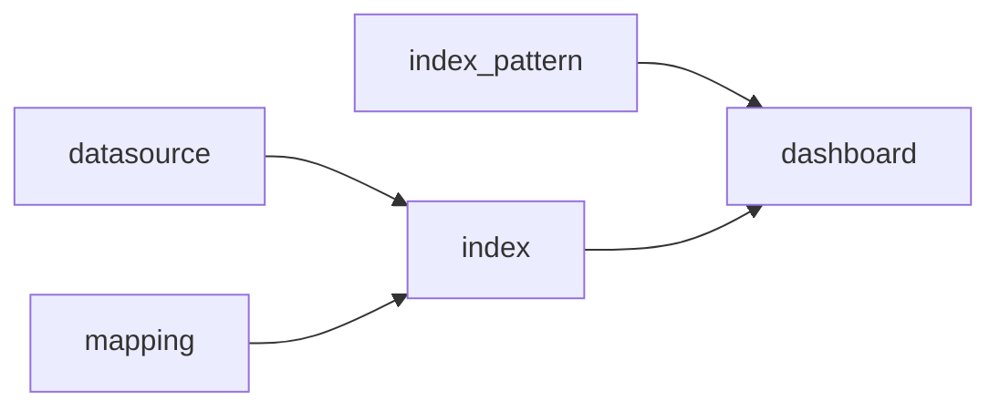
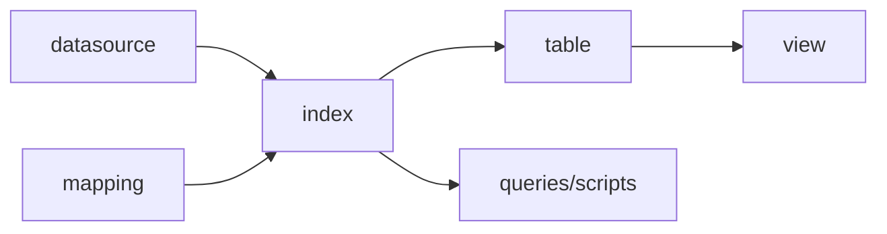
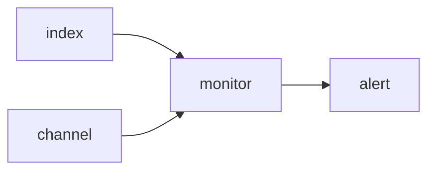

# Integration Definitions

An integration is a bundle of pre-canned assets which are bundled togather in a meaningful manner. Mostly the integration is associated with a particular context which is
contained within a certain data domain. For an example we can consider the Observability domain as the generic context and as a specific subject we can define the next integrations which
are collected according to a subject:
 - nginx web server integration includes dashboards, queries and index mapping
 - aws vpc flow logs integration includes dashboards, queries and index mapping

Each integration has a bundle of assets which are associated with the domain context and are mostly coupled with specific schema category (logs, traces, metrics).

## Bundle

An OpenSearch Integration Bundle may contain the following:
 - dashboards
 - visualisations
 - configurations 
These bundle assets are designed to assist monitor of logs and metrics for a particular resource (device, network element, service ) or group of related resources, such as “Nginx”, or “System”.

---

The Bundle consists of:

* Version 
* Metadata configuration file 
* Dashboards and visualisations and Notebooks
* Data stream index templates used for the signal's ingestion
* Documentation & information


## Integration

An integration is a type of _bundle_ defining data-streams for ingetion of a resource observed signals using logs, metrics, and traces.

### Structure
As mentioned above, integration is a collection of elements that formulate how to observe a specific data emitting resource - in our case a telemetry data producer.

A typical Observability Integration consists of the following parts:

***Metadata***

    * Observability data producer resource
    * Supplement Indices (mapping & naming)
    * Collection Agent Version
    * Transformation schema 
    * Optional test harnesses repository
    * Verified version and documentation 
    * Category & classification (logs/traces/alerts/metrics)

***Display components***

    * Dashboards 
    * Maps
    * Applications
    * Notebooks
    * Operations Panels
    * Saved PPL/SQL/DQL Queries
    * Saved PPL/SQL/DQL Scripts
    * Alerts

***Data Structure Components***

    * Datasource
    * Mappings
    * Indices
    * Tables
    * Views

***Notification Components***

    * Channels
    * Alerts
    * Monitors


Since the structured data has an enormous contribution to the understanding of the system behaviour - each resource will define a well-structured mapping it conforms with.

Once input content has form and shape - it can and will be used to calculate and correlate different pieces of data.

The next parts of this document will present **Integrations For Observability** which has a key concept of Observability schema.

It will overview the concepts of observability, will describe the current issues customers are facing with observability and continue to elaborate on how to mitigate them using Integrations and structured schemas.

---

###  Creating An Integration

```yaml

integration-template-name
    config.json
    display
        Application.json
        Maps.json
        Dashboard.json
    stored-queries
      Query.json
    transformation-schemas
      transformation.json
    samples
      resource.access logs
      resource.error logs
      resource.stats metrics
      expected_results
    info  
      documentation
      images
```

**Definitions**

- `config.json`  defines the general configuration for the entire integration component.
- `display`      this is the folder in which the actual visualization components are stored
- `queries`      this is the folder in which the actual PPL/SQL/DQL queries are stored
- `scripts`      this is the folder in which the actual PPL/SQL/DQL scripts are stored
- `templates`    this is the folder in which the index mappings stored
- `indices`      this is the folder in which the index definition are stored
- `tables`       this is the folder in which the external table definition are stored
- `views`        this is the folder in which the external table definition are stored
- `datasource`   this is the folder in which the datasource definition are stored
- `monitors`      this is the folder in which the monitors & alerts are stored
- `channels`      this is the folder in which the alters channels are defined.

- `schemas`      this is the folder in which the schemas are stored - schema for mapping translations or index mapping.
- `samples`      this folder contains sample logs and translated logs are present
- `metadata`     this folder contains additional metadata definitions such as security and policies
- `info`         this folder contains documentations, licences and external references

---

#### Config

`Config.json` file includes the following Integration configuration see [NginX config](nginx/config.json)
 
 Additional information on the config structure see [Structure](../docs/Integration-structure.md)  

#### Display:

Visualization contains the relevant visual components associated with this integration.

The visual display component will need to be validated to the schema that it is expected to work on - this may be part of the Integration validation flow...

#### Queries

Queries contains specific PPL queries that precisely demonstrates some common and useful use-case .


## Flow of the assets creation process
Different assets that are bundled within an integration may be depended on one another, the next diagram details the order which describes the dependencies within the Integration. 

***Visual Components***


***Data Structure Components***


***Notification Components***

