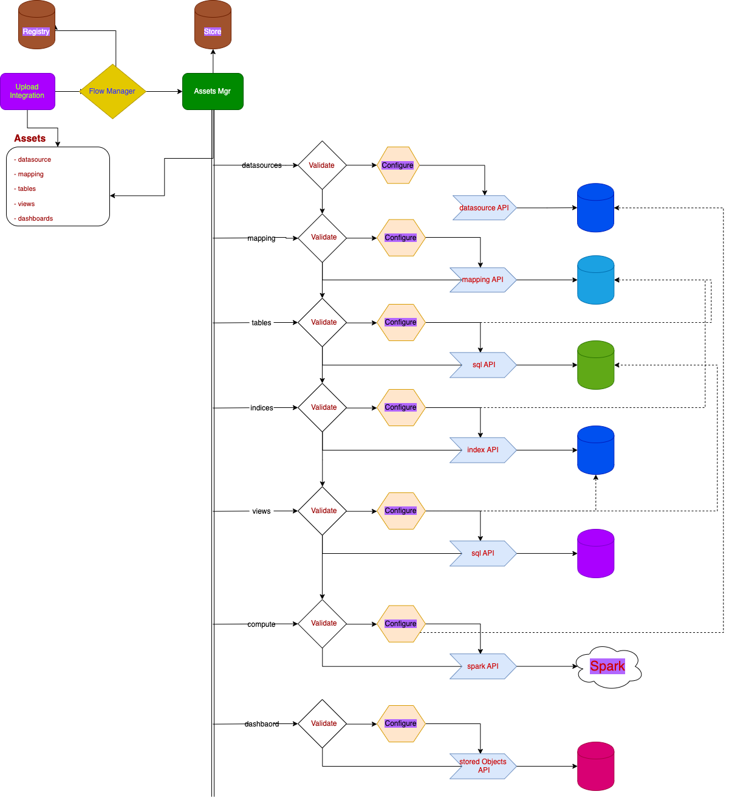

# What is [ALB](https://docs.aws.amazon.com/elasticloadbalancing/latest/application/load-balancer-access-logs.html) 

AWS Application Load Balancer (ALB) is a service offered by Amazon Web Services (AWS) that helps distribute incoming application traffic across multiple targets, such as Amazon EC2 instances, containers, or IP addresses. It is a part of AWS Elastic Load Balancing (ELB) services, which also include the Classic Load Balancer (CLB) and the Network Load Balancer (NLB).

The ALB operates at the application layer (Layer 7) of the Open Systems Interconnection (OSI) model and is designed to route HTTP/HTTPS traffic. It can make routing decisions based on the content of the request, allowing more advanced load distribution compared to the Classic Load Balancer.

## What is ALB Integration

ALB integration is concerned with the following aspects

- Allow simple and automatic generation of all schematic structured
    - logs (using the standard SS4O logs schema including specific cloud components logs & custom AWS Elb logs)
    - metrics (using the standard SS4O schema)

- Add Dashboard Assets for both logs / metrics

- Add correlation queries to investigate logs based metrics

This integration helps data flow as described in the next diagram:

## ALB logs fields

The following table describes the fields of an access log entry.

## Logs reference

The `elb` dataset collects logs from AWS ELBs.

**Exported fields**

The aws logs mapping fields contain the next components categories:
 - [http](../../../src/main/resources/schema/observability/logs/http.mapping)
 - [communication](../../../src/main/resources/schema/observability/logs/communication.mapping)
 - [cloud](../../../src/main/resources/schema/observability/logs/cloud.mapping)
 - [container](../../../src/main/resources/schema/observability/logs/container.mapping)
 - [aws_elb](../../../src/main/resources/schema/observability/logs/aws_alb.mapping)

### Integration Loading Process
The AWS ALB logs integration loading process includes the following assets
 - **Connectivity**
   - S3 Datasource connectivity
   - Spark compute engine connectivity
 - **Tables**
   - alb logs external table (definition including fields mapping to observability logs template)
   - alb logs index (definition based on observability logs template)
 - **Views**
   - alb log materialized view (view is a pre-calculated query based on a specific given dimension)
   - alb metrics materialized view (view is a pre-calculated query based on a specific given dimension)
 - **Display**
   - alb dashboard for viewing all the given information in a meaningful manner

#### Assets Loading Order 
The general order for which the assets are needed to be loaded is dictated by the next concepts:

1) Connectivity - First the connection related configuration are required to be validated for existence and correctness.

---
2) Mapping - Next the schema specific instruction dictated by the integration's config must be verified for existence or be created

---
3) Tables - Next the external / internal tables / indices will be verified for existence or be created - (they are based on the mapping phase and connectivity phase )

---
4) Views - Next the views search templates need to be created (they are based on the tables and connectivity phase  )

---
5) Display - Last the dashboards and visual assets are uploaded (they are based on the views, tables and connectivity phase)

---

### Integration assets flow 
The next diagram describes the ALB-Logs Integration assets loading and validation process for the flow manager to upload as part of the state transitions. 

This diagram details different aspects of the interaction between the visual dashboard and panels to the backing SQL queries that would be executed. 

